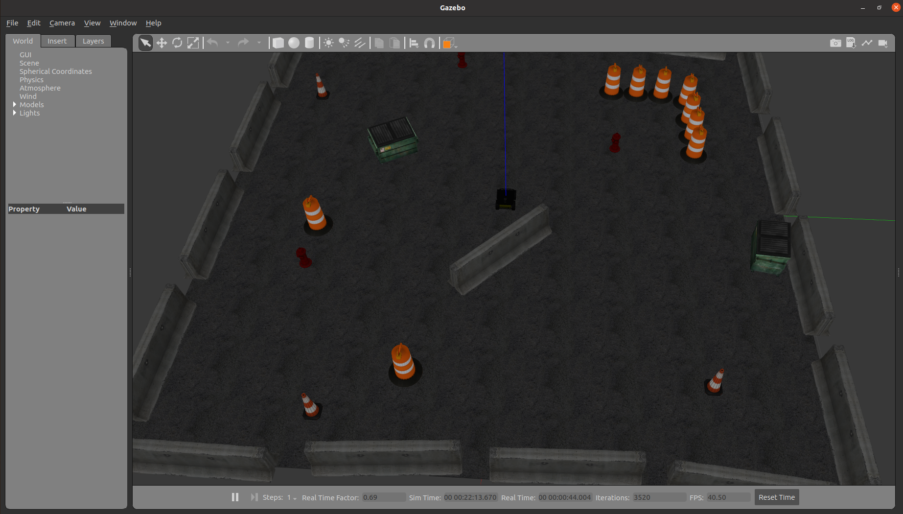
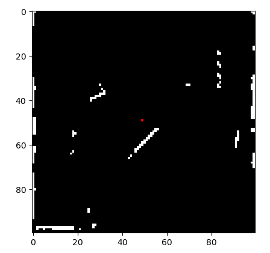

# Simultaneous Localization and Mapping

## What is in this repository?

This repository contains my implementation of FastSLAM algorithm presented in the Probabilistic Robotics book. 

In other words, the presented ROS package utilizes the robot's odometry and lidar data to map the environment as well as to estimate the robot's pose by means of Monte-Carlo localization. The developed algorithm is simulated in Gazebo using the ClearPath Husky robot.

Simulation in Gazebo: 
<figure>
  
</figure>

Map of the environment (robot location in green):
<figure>
  
</figure>


## How to install the package?

Open a terminal and follow the below steps to clone the package

```bash
mkdir -p catkin_ws/src
cd catkin_ws
catkin init
cd src
git clone https://github.com/OmarJItani/Simultaneous-Localization-and-Mapping.git
cd ..
catkin_make
```

## How to test the package?

To launch the husky robot in gazebo, open a terminal and type:

```bash
export HUSKY_LMS1XX_ENABLED=1;
roslaunch husky_gazebo husky_playpen.launch
```

To run the slam node, open a new terminal and type:

```bash
rosrun fast_slam_husky_gazebo my_husky_fastslam.py
```

To move the husky robot from your keyboard, open a new terminal and type:

```bash
rosrun key_teleop key_teleop.py key_vel:=/husky_velocity_controller/cmd_vel
```
